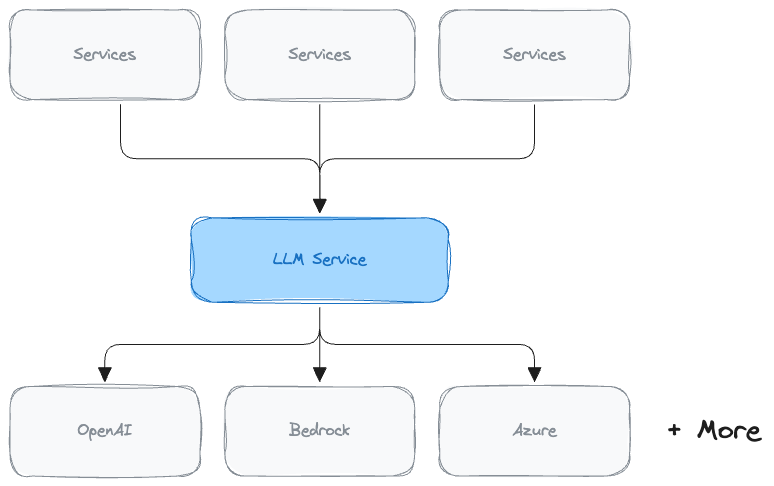

# AutogenAI Coding Interview

Welcome!
This codebase contains a minimal repo representing our LLM Service.

In the real world, this service acts as an abstraction over all the LLMs that we use.
Its task is to:
- provide a single unified interface for interacting with LLMs
- match requests to suitable LLMs
- manage the pool of LLMs (rate limits, circuit breaking etc)

## Interview Setup
We can run the interview in either Python or TypeScript - up to you.
- [Python Setup](./python/setup.md)
- [Typescript Setup](./typescript/setup.md)

Setup should hopefully be fast, and there's no need to prep anything else.

In either python or typescript, you should find:
- a main/server file defining a '/chat' endpoint and a '/chat/stream' endpoint.
- a chat file containing some (messy) code that calls the models to get a response
- a 'stubs' directory containing some stub LLM Clients.
    - based on real type definitions from OpenAI & Bedrock
    - (but doesn't actually call anything interesting)
    - We'll consume these files in interview, but otherwise ignore them.

